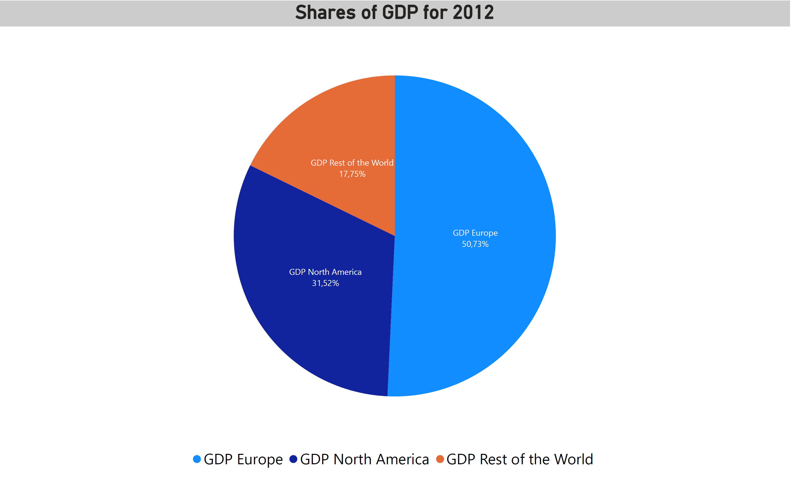

# Data Visualisation with Power BI
I opted for Power BI due to its user-friendly nature, as well as its strong compatibility with both Excel and SQL Server Management Studio (SSMS).
This project builds upon the SQL Challenge, where I convert raw data obtained from SQL queries into visual representations.

## Instruction :
Visualize the results of the questions 3, 4 & 5 from the SQL exercise.

### Question 3 visualisation :
Shares of GDP Per Capita :

